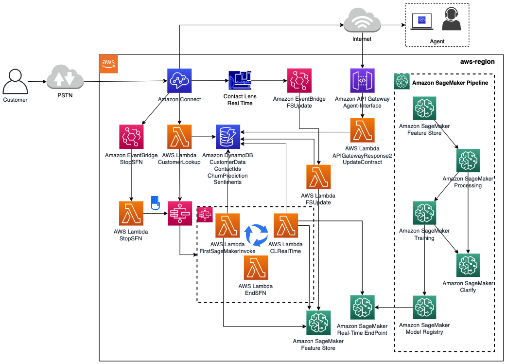

## Real-time Churn Prediction with Amazon Connect and Amazon SageMaker

This repository provide a demonstration of how to build a real-time customer churn prediction pipeline for contact centers using Amazon connect and Amazon SageMaker services.

## Architecture

The following is the architecture diagram for the "Real-Time churn prediction with Amazon Connect and Amazon SageMaker".

 

## Deployment

### Contact Lens for Amazon Connect

This solution requires:

- An existing Amazon Connect instance with Contact Lens for Amazon Connect enabled
- Contact Flows enabled for "Real-Time and post call analytics" in the "Set recording and analytics behavior"
- Create three (3) Real-time Contact Lens Rules with a "Sentiment - Time period" from the "Customer" for positive, negative, and neutral sentiments for the past 15 seconds of the contact

- Assign a contact category called PositiveSentiment, NegativeSentiment, and NeutralSentiment for each of the rules
- Add an action "Generate an EventBridge event" using the same name of the category

### Amazon SageMaker

Go through the steps defined in the Jupyper notebook [contact-center-data.ipynb](https://github.com/aws-samples/real-time-churn-prediction-with-amazon-connect-and-amazon-sagemaker/blob/main/contact-center-data.ipynb).

### AWS CloudFormation Stack

**NOTE: CloudFormation Stack has not been uploaded to the repository**

The CloudFormation stack Summit2022-Template-v2.yaml will create all the serverless applications required for the solution. The input parameters of the CloudFormation stack include Amazon Connect ARN, Amazon Connect Instance, Amazon SageMaker Endpoint name, and Amazon SageMaker Feature Group Name.

The outputs of the CloudFormation stack includes:

- All outputs include a Summit2022 name prefix
- **AWS Lambda** functions as described in the architecture diagram
- **AWS Step Functions** StateMachine
- **Amazon API Gateway** for the agent Interface to query churn predictions and to update contract information
- **Amazon EventBridge** rules to update Feature Store based on Contact Lens Rules and to Stop the StateMachine when the call ends
- **Amazon DynamoDB** tables for Customer Data, Sentiments, ContactIds, and  Churn Predictions
- **AWS IAM** roles for all the services created

### Lambda functions with Pandas Layer pre-requisite

There are lambda functions that will need [Pandas](https://pandas.pydata.org/) Layer, these are:
- CLRealTime - python3.7
- FSUpdate - python 3.7
- UpdateContract - python 3.7

### Amazon Connect

The CustomerLookup lambda function needs to be added to the list of AWS lambda functions that the Amazon Connect instance has permission to access. This is done in the AWS Console > Amazon Connect > Contact Flows > AWS Lambda. Use the Lambda function in your contact flow with the "Invoke AWS Lambda function" block.

### Amazon DynamoDB

Four (4) DynamoDB tables will be created by the CloudFormation stack, CustomerData, ContactIds, ChurnPrediction, and Sentiments. The **CustomerData** has PhoneNumber (e.164) as partition key and it requires a **"customerid"** attribute to identify the customer, this attribute is the same **"customerid"** used by SageMaker.

## Security

See [CONTRIBUTING](CONTRIBUTING.md#security-issue-notifications) for more information.

## License

This library is licensed under the MIT-0 License. See the LICENSE file.

