# Real-time Churn Prediction with Amazon Connect and Amazon SageMaker

This repository provide a demonstration of how to build a real-time customer churn prediction pipeline for contact centers using Amazon connect and Amazon SageMaker services.

## Architecture

The following is the architecture diagram for the "Real-Time churn prediction with Amazon Connect and Amazon SageMaker".

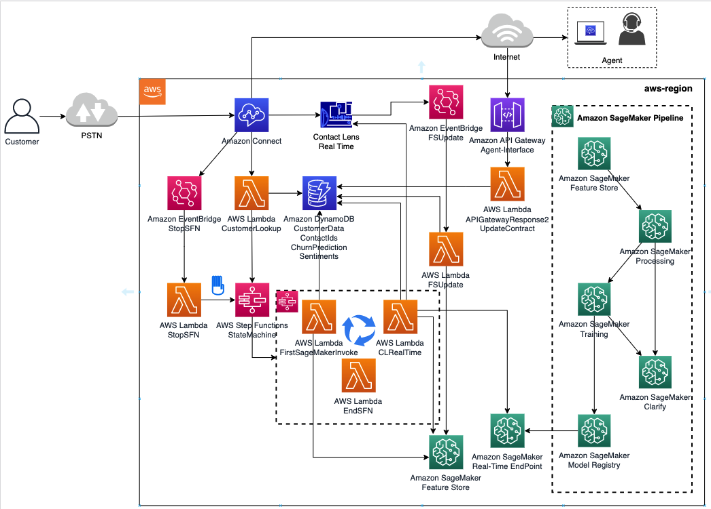 

## Deployment

### Prerequisites

Users need to be familiar with the below AWS services:

- Amazon SageMaker
- Amazon Connect
- AWS Lambda
- AWS Step Functions
- Amazon API Gateway
- Amazon S3 and CloudFront

### Contact Lens for Amazon Connect

This solution requires:

- An existing Amazon Connect instance with Contact Lens for Amazon Connect enabled
- Contact Flows enabled for "Real-Time and post call analytics" in the "Set recording and analytics behavior"
- Create three (3) Real-time Contact Lens Rules with a "Sentiment - Time period" from the "Customer" for positive, negative, and neutral sentiments for the past 15 seconds of the contact

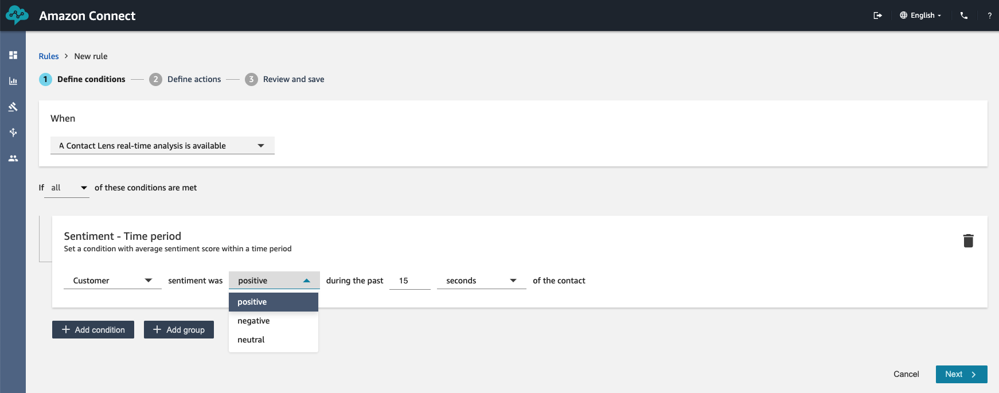

- Assign a contact category called PositiveSentiment, NegativeSentiment, and NeutralSentiment for each of the rules
- Add an action "Generate an EventBridge event" using the same name of the category

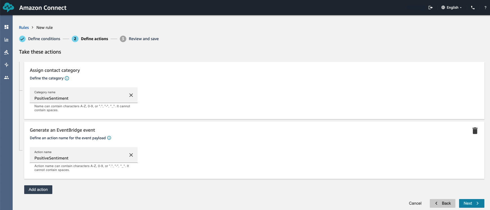

### Amazon SageMaker

Clone the [github repo](https://github.com/aws-samples/real-time-churn-prediction-with-amazon-connect-and-amazon-sagemaker) into SageMaker Studio. 

#### Model Build Pipeline

1. Ingest data into SageMaker Feature Store
- Go through the steps defined in the Jupyter notebook [contact-center-data.ipynb](https://github.com/aws-samples/real-time-churn-prediction-with-amazon-connect-and-amazon-sagemaker/blob/main/contact-center-data.ipynb). This notebook will create a Feature Group (FG) and ingest data into the FG using a SageMaker Processing job based on the SageMaker Data Wrangler flow file.

2. Build the churn model using SageMaker Pipeline
- Go through the steps defined in the Jupyter notebook [demo_customer_churn_pipeline.ipynb](https://github.com/aws-samples/real-time-churn-prediction-with-amazon-connect-and-amazon-sagemaker/blob/main/demo_customer_churn_pipeline.ipynb). This notebook will create a SageMaker Pipeline to create the machine learning model for real-time churn prediction. A complete build pipeline looks like below:

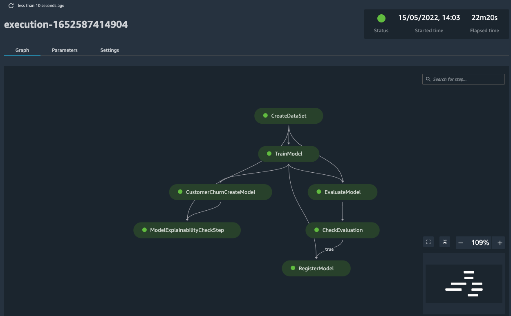


#### Model Deployment using SageMaker prebuilt project template

To deploy the trained model from model registry, you can simply use the SageMaker built-in Project template to deploy the model to your staging and production environment.


Follow the steps to create the model deployment pipeline using SageMaker Project:

1. From the SageMaker Create Project page, select the *MLOps teamplate for model deployment* template and click the **Select Project template** button at the bottom right;


This template is designed to automate the deployment of models in the Amazon SageMaker model registry to SageMaker Endpoints for real-time inference. The template provisions an AWS CodeCommit repository with configuration files to specify the model deployment steps, CloudFormation templates to define endpoints as infrastructure, and seed code for testing the endpoint. You can customize the template to suit your requirements or add more tests. AWS CodePipeline is used to orchestrate the model deployment. 
- repository: AWS CodeCommit 
- Orchestration: AWS CodePipeline

2. Fill in the required information, such as the model group name, project name and etc., and create the project;


3. Once the project is created, you can clone the repository to your stuido local folder

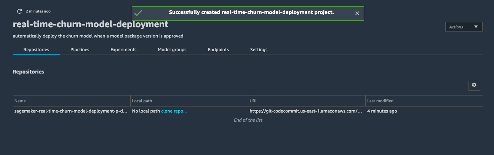


4. Click the link to open the local file folder on the left panel;

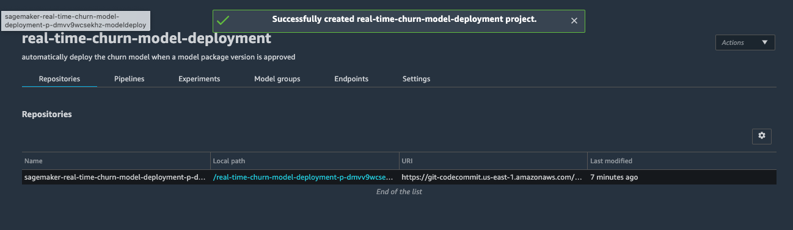

5. You can update the "test.py" file in the test folder to add custom logic to test the endpoint. In this example, we will leave it as for now to automatically pass the endpoint test;

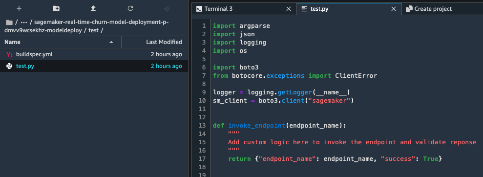

6. This project will create two event bridge rules. One is used to trigger deployment when a model status is changed in model registry and the other one is used to trigger deployment to production when a CodeCommit is updated with manual approval;

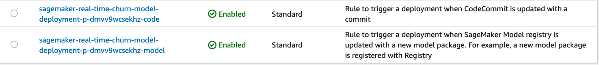

7. From the CodePipeline console, you can see the pipeline is in the "In progress" status waiting for manual approval of the staging endpoint;

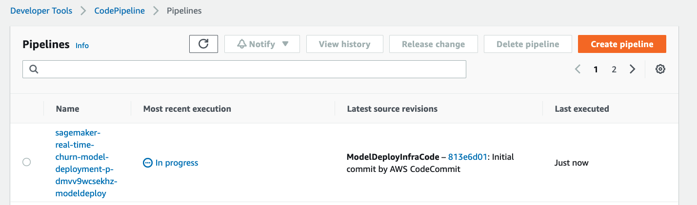

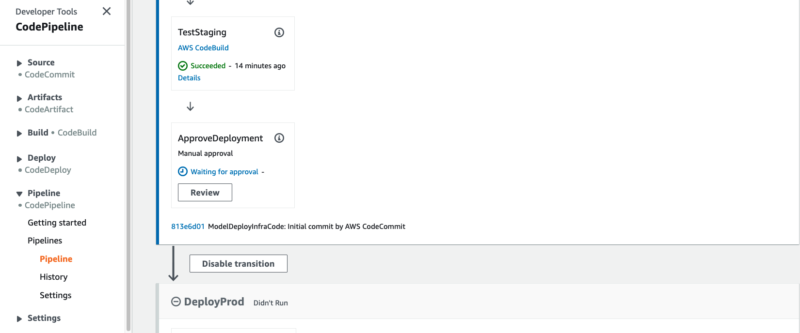

8. After the necessary unit tests are done and confirming the endpoint deployed in the staging endpoint is ready for production. We can provide manual approval to trigger the production deployment step;


9. Once the DeployProd step in the pipeline is finished, a production endpoint is available to serve real-time inference request for churn prediction.

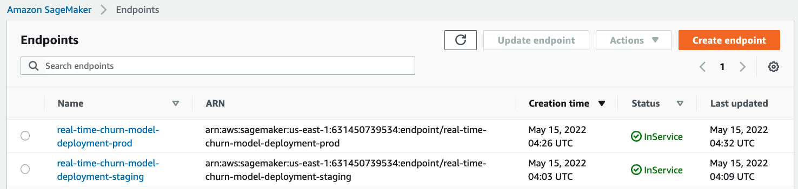


### AWS CloudFormation Stack

**NOTE: CloudFormation Stack has not been uploaded to the repository**

The CloudFormation stack Summit2022-Template-v3.yaml, in the cloudformation folder, will create all the serverless applications required for the solution. The input parameters of the CloudFormation stack include Amazon Connect ARN, Amazon Connect Instance, Amazon SageMaker Endpoint name, and Amazon SageMaker Feature Group Name.

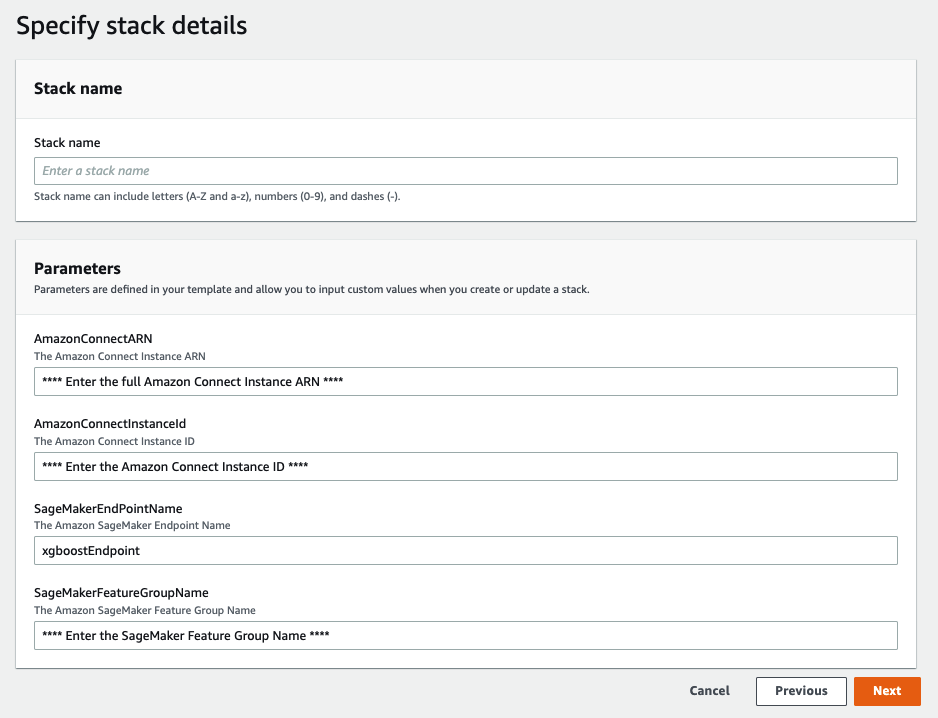

The outputs of the CloudFormation stack includes:

- All outputs include a Summit2022 name prefix
- **AWS Lambda** functions as described in the architecture diagram
- **AWS Step Functions** StateMachine
- **Amazon API Gateway** for the agent Interface to query churn predictions and to update contract information
- **Amazon EventBridge** rules to update Feature Store based on Contact Lens Rules and to Stop the StateMachine when the call ends
- **Amazon DynamoDB** tables for Customer Data, Sentiments, ContactIds, and  Churn Predictions
- **AWS IAM** roles for all the services created

### Lambda functions with Pandas Layer pre-requisite

There are lambda functions that will need [Pandas](https://pandas.pydata.org/) Layer, these are:
- CLRealTime - python3.7
- FSUpdate - python 3.7
- UpdateContract - python 3.7

### Amazon Connect

The CustomerLookup lambda function needs to be added to the list of AWS lambda functions that the Amazon Connect instance has permission to access. This is done in the AWS Console > Amazon Connect > Contact Flows > AWS Lambda. Use the Lambda function in your contact flow with the "Invoke AWS Lambda function" block.

### Amazon DynamoDB

Four (4) DynamoDB tables will be created by the CloudFormation stack, CustomerData, ContactIds, ChurnPrediction, and Sentiments. The **CustomerData** has PhoneNumber (e.164) as partition key and it requires the following attributes (string):

- ```customerid```
- ```contractedMonths```
- ```email```
- ```FirstName```
- ```LastName```

### Amazon S3 and CloudFront

Create an Amazon S3 bucket and a CloudFront distribution with that S3 bucket as the origin. Use CCPcustom.html as the default root object.

Update the Approved origins in the AWS Management Console > Amazon Connect adding the new created Cloudfront URL.

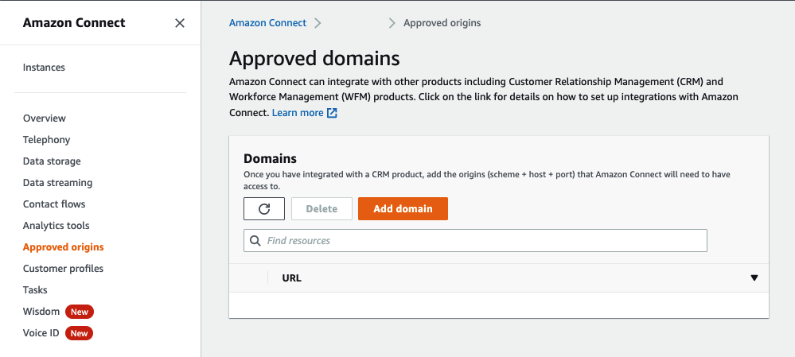

### Agent Custom CCP

To build the Agent Custom CCP upload the files in the website folder, update the CCPcustom.html with the following information:

- Line 80 - ```var instanceURL = "***ADD your Amazon Connect CCP v2 URL***"```
- Line 185 - ```"url": "***apiGatewayInvokeURLchurn URL - Output of CloudFormation***"```
- Line 395 - ```"url": "***apiGatewayInvokeURLcontract URL - Output of CloudFormation***"```

The website will look as below:

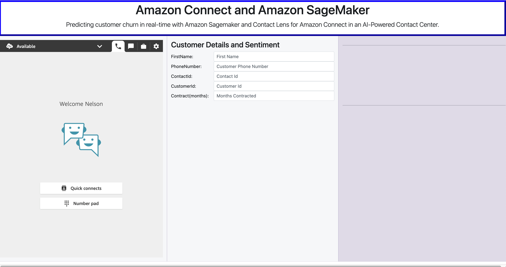

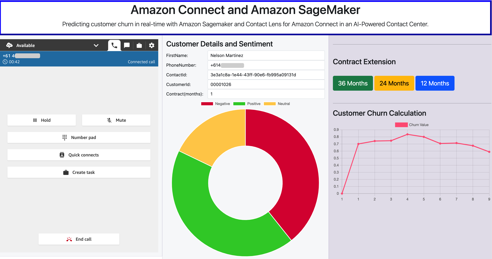

## Clean Up

Following these steps to clean up the project:

- Use the Clean Up cell in the demo customer churn pipeline notebook to clean up resources created in the model build process
- Delete the SageMaker project from the SageMaker project console, this will delete the code pipeline, but cloudformation templates and repositories created using this project will need to be manually deleted
- CloudFormation, delete the stack created as part of the process above
- CloudFront, delete the distribution
- S3, delete the bucket used to store the files of the website
- Amazon Connect, disable Contact Lens in the Contact Flows enabled at the start of the project

## Security

See [CONTRIBUTING](CONTRIBUTING.md#security-issue-notifications) for more information.

## License

This library is licensed under the MIT-0 License. See the LICENSE file.